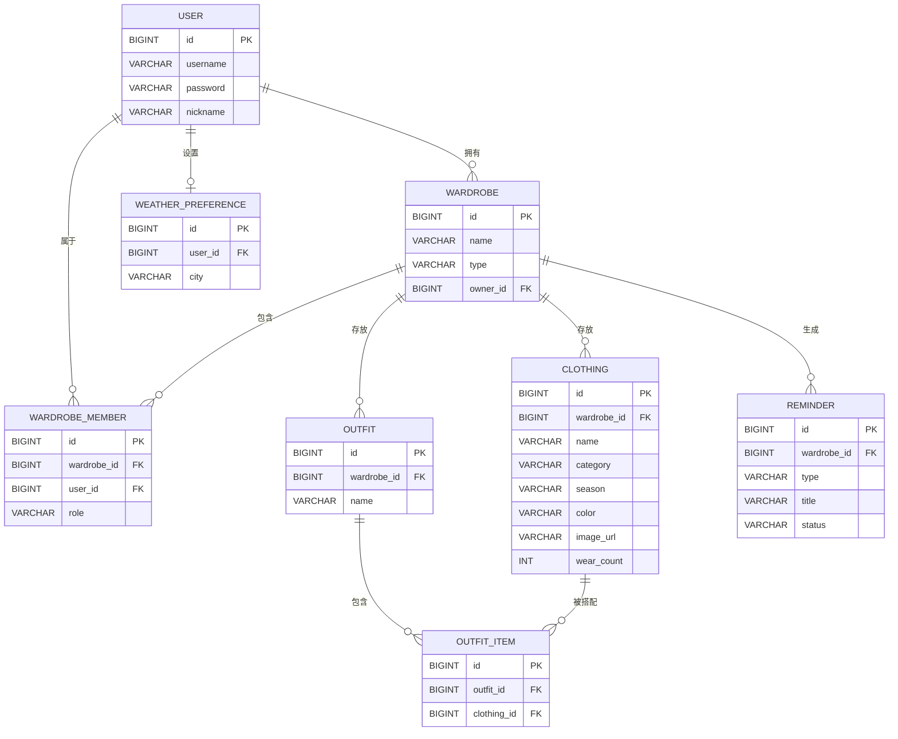

# 基于 Spring Boot 与 Vue3 的电子衣橱系统的设计与实现

## 摘要

随着人们生活水平的提升与服饰消费的增长，个人衣物数量迅速膨胀，传统依靠记忆力或纸质笔记管理衣物的方式已难以满足用户对穿搭规划、季节整理与闲置清理的需求。针对这一问题，本文设计并实现了一套基于 Spring Boot 与 Vue3 的电子衣橱系统。

系统采用前后端分离的架构：后端基于 Spring Boot 2.7（Java 8）与 Spring Data JPA 构建 RESTful 接口，使用 JWT 实现无状态身份认证；前端基于 Vue3、Element Plus、Vite、Pinia 与 ECharts 实现响应式单页应用；数据持久化采用 MySQL 8。系统围绕个人服饰管理，实现了衣物录入与分类筛选、关键词搜索、手动搭配、天气联动穿衣建议、多维数据分析与场景化智能提醒等核心功能；并引入多角色、多衣柜的权限与数据隔离模型，支持家庭成员共享同一衣柜。其中，天气联动模块在缺乏外部 API 密钥或网络异常时自动降级为本地模拟数据，场景提醒基于衣物穿着频次与闲置时长等规则自动生成，体现了系统在离线鲁棒性与智能化方面的设计考量。

系统经功能测试与非功能测试验证，各模块运行稳定，权限隔离与参数化查询有效，达到了预期设计目标，可为个人及家庭的服饰管理提供实用、轻量的信息化解决方案。

**关键词**：电子衣橱；Spring Boot；Vue3；前后端分离；衣物管理；智能提醒

## Abstract

With the improvement of living standards and the growth of clothing consumption, the number of personal garments has increased rapidly. Traditional methods of managing clothes by memory or paper notes can no longer meet users' needs for outfit planning, seasonal organization, and idle-item cleanup. To address this problem, this paper designs and implements an Electronic Wardrobe System based on Spring Boot and Vue3.

The system adopts a front-end and back-end separated architecture. The back end is built with Spring Boot 2.7 (Java 8) and Spring Data JPA to provide RESTful APIs, and uses JWT for stateless authentication. The front end is a responsive single-page application implemented with Vue3, Element Plus, Vite, Pinia, and ECharts. MySQL 8 is used for data persistence. Centered on personal garment management, the system implements core functions such as clothing entry with category filtering, keyword search, manual outfit matching, weather-aware dressing suggestions, multi-dimensional data analytics, and scenario-based intelligent reminders. A multi-role and multi-wardrobe permission and data-isolation model is introduced to support family members sharing a wardrobe. Notably, the weather module automatically degrades to locally simulated data when an external API key is absent or the network is unavailable, and scenario reminders are generated automatically based on rules such as wearing frequency and idle duration, reflecting the system's robustness and intelligence.

The system has been verified through functional and non-functional testing. All modules run stably, permission isolation and parameterized queries are effective, and the design goals are achieved, providing a practical and lightweight information-based solution for personal and family garment management.

**Keywords**: Electronic Wardrobe; Spring Boot; Vue3; Front-end/Back-end Separation; Clothing Management; Intelligent Reminder

---

# 第 1 章 绪论

## 1.1 研究背景与意义

近年来，快时尚与电商的普及使个人衣物保有量持续上升，"衣橱爆满却总觉无衣可穿"成为普遍困扰。一方面，用户难以快速定位某件衣物、掌握各类服饰的存量结构；另一方面，换季整理、闲置清理与每日穿搭决策消耗大量精力。与此同时，家庭成员之间的衣物常混放共用，缺乏统一的管理与共享手段。

信息技术的发展为上述问题提供了解决路径。将衣物信息数字化、管理线上化，不仅能帮助用户清晰掌握衣橱全貌，还能借助数据分析与规则引擎提供穿搭与清理建议。因此，研发一套操作便捷、功能完备、可多端使用的电子衣橱系统，具有较强的现实意义与应用价值。

## 1.2 国内外研究现状

国外较早出现了以穿搭推荐为核心的商业应用，其多依赖海量用户数据与机器学习模型，对数据规模与算力要求较高，且本地化与隐私适配不足。国内相关产品则以电商导购为主，聚焦"买"而非"管"，对个人已有衣物的管理与家庭共享支持有限。

在学术与开源层面，基于 Web 或移动端的个人物品管理系统的研究较多，但多数功能单一（仅做增删改查），缺乏对搭配、天气、数据分析与智能提醒的一体化设计，也较少考虑多用户共享场景。本文在上述基础上，构建一个集衣物管理、手动搭配、天气联动、数据分析与场景提醒于一体的轻量级系统，并引入多角色多衣柜的隔离模型，兼顾功能完整性与部署简便性。

## 1.3 研究的主要内容

本文的研究内容如下：

1. 调研个人衣物管理的业务流程，梳理功能性与非功能性需求，设计系统总体架构。
2. 基于前后端分离模式，完成后端 Spring Boot + JPA 的数据模型与业务接口，以及前端 Vue3 + Element Plus 的交互页面。
3. 实现衣物管理、手动搭配、天气联动、数据分析与场景提醒五大核心模块。
4. 设计多角色多衣柜的权限与数据隔离机制，保障共享场景下的数据安全。
5. 对系统进行功能测试与非功能测试，验证系统达到设计目标。

## 1.4 论文组织结构

- 第 1 章 绪论：阐述研究背景、意义、现状与主要内容。
- 第 2 章 相关技术与开发环境：介绍系统所采用的关键技术与工具。
- 第 3 章 系统需求分析：分析功能性需求与非功能性需求。
- 第 4 章 系统设计：包括总体架构、数据库设计、接口设计。
- 第 5 章 系统实现：分模块阐述核心代码与实现要点。
- 第 6 章 系统测试：给出测试用例与结果分析。
- 第 7 章 总结与展望：总结成果并指出改进方向。

---

# 第 2 章 相关技术与开发环境

## 2.1 前后端分离架构

系统采用前后端分离的开发模式：前端负责页面渲染与用户交互，后端通过 RESTful API 提供数据与业务逻辑，二者通过 HTTP + JSON 通信。该模式解耦了视图与业务，便于独立开发、测试与部署，也利于后期横向扩展。

## 2.2 后端相关技术

- **Spring Boot 2.7 / Java 8**：简化 Spring 应用的配置与搭建，内嵌容器、自动装配，提升开发效率。
- **Spring Data JPA**：基于 Hibernate 的对象关系映射框架，以 Repository 接口声明式访问数据库，减少样板代码。
- **JWT（JSON Web Token）**：用于无状态身份认证，令牌中携带用户标识，后端拦截器统一校验，避免会话存储。
- **RESTful API**：以资源为中心设计接口，配合统一返回结构与全局异常处理，接口风格清晰一致。

## 2.3 前端相关技术

- **Vue3**：渐进式 JavaScript 框架，组合式 API 提升代码组织与复用能力。
- **Element Plus**：基于 Vue3 的 UI 组件库，提供表单、表格、弹窗等开箱即用组件。
- **Vite**：面向现代浏览器的前端构建工具，启动快、热更新高效。
- **Pinia**：Vue3 官方推荐的状态管理库，用于管理用户登录态与当前衣柜等全局状态。
- **Axios**：HTTP 客户端，统一封装请求/响应拦截，自动携带 JWT。
- **ECharts**：数据可视化库，用于分析页的品类、季节、颜色分布与穿着 Top5 等图表。

## 2.4 数据库与运行环境

- **MySQL 8**：关系型数据库，用于存储用户、衣柜、衣物、搭配、提醒等结构化数据，通过外键与索引保障一致性与查询性能。
- **开发环境**：Windows 11、JDK 8、IntelliJ IDEA、Node.js 22、MySQL 8、Chrome 浏览器。

---

# 第 3 章 系统需求分析

## 3.1 总体功能结构

系统面向个人 / 家庭用户的服饰数字化管理，采用前后端分离架构：前端 Vue3 通过 RESTful API 与 Spring Boot 后端交互，业务数据持久化于 MySQL。

系统划分为 6 大功能模块：**用户与权限管理、衣物管理、手动搭配、天气联动、数据分析、场景提醒**。

## 3.2 功能性需求

### 3.2.1 用户与权限管理（登录 / 注册 / 多角色 / 切换衣柜）
- **注册与登录**：基于账号密码 + JWT 令牌鉴权，保证接口安全。
- **多角色**：内置「管理员」「普通成员」两类角色；管理员可管理衣柜成员与共享权限，成员仅能操作被授权衣柜。
- **切换衣柜**：支持一名用户创建 / 归属多个衣柜（如本人衣柜、家庭共享衣柜），顶部可一键切换当前操作衣柜；衣物、搭配等数据均按「衣柜」维度隔离。

### 3.2.2 衣物管理
- **添加衣物**：支持「拍照上传」与「相册选择」两种方式，图片经后端存储并生成可访问 URL。
- **分类标签**：按季节、品类（上衣 / 下装 / 鞋帽 / 配饰等）、颜色、风格、场合打标签。
- **分类筛选**：按上述标签任意组合筛选。
- **搜索**：按名称 / 标签关键词模糊搜索。
- **CRUD**：衣物信息的增、删、改、查与详情查看。

### 3.2.3 手动搭配
- **创建搭配**：从当前衣柜衣物中多选组合成一套搭配方案，可命名并附说明。
- **查看 / 编辑 / 删除**：搭配方案的维护与历史查看。
- **搭配记录**：记录每次选用搭配的时间，为数据分析与场景提醒提供依据。

### 3.2.4 天气联动（自定义城市选择）
- **城市选择**：用户自定义所在城市（支持搜索 / 手动输入），并持久化用户偏好。
- **天气获取**：调用第三方天气 API（如 OpenWeatherMap）获取实时天气与温度。
- **穿衣建议**：依据温度、天气状况联动展示适宜的衣物类型提示，辅助用户快速决策。

### 3.2.5 数据分析页
- **衣物构成分析**：按品类、季节、颜色等维度统计分布（饼图 / 柱状图）。
- **穿着频率分析**：基于搭配 / 穿着记录统计各衣物使用频次。
- **闲置分析**：统计长期未使用衣物的占比（闲置率）。
- **数据可视化**：使用 ECharts 等前端图表库渲染。

### 3.2.6 场景提醒
- **闲置提醒**：识别超过设定天数未穿着的衣物并提醒。
- **天气提醒**：结合天气联动，在低温 / 降雨等场景下推送穿衣提醒。
- **搭配提醒**：基于历史搭配习惯，提示可复用搭配方案。
- **不均衡提醒**：检测某品类衣物数量明显偏多 / 偏少，提示购置或清理建议。

## 3.3 非功能性需求

- **性能**：千级数据量下，常规列表 / 查询接口响应 ≤ 500ms。
- **安全**：JWT 鉴权、密码加盐哈希、接口按角色鉴权、图片上传类型与大小校验。
- **可用性**：响应式布局，适配桌面与移动端；关键操作有反馈与二次确认。
- **可维护性**：前后端分离、模块化、统一返回结构与全局异常处理。

## 3.4 核心数据实体（概要）

| 实体 | 说明 |
|------|------|
| user | 用户（账号、密码哈希、角色） |
| wardrobe | 衣柜（归属人、类型：个人 / 共享） |
| wardrobe_member | 衣柜成员（多对多，含角色） |
| clothing | 衣物（图片 URL、分类标签、所属衣柜） |
| outfit | 搭配（名称、说明、所属衣柜） |
| outfit_item | 搭配明细（搭配与衣物多对多） |
| weather_preference | 天气偏好（用户—城市绑定） |
| reminder | 提醒记录 / 规则 |

---

# 第 4 章 系统设计

## 4.1 总体架构设计

```
浏览器(Vue3 + Element Plus 单页应用)
        │  HTTPS / AJAX(Bearer JWT)
        ▼
前端构建/静态服务(Vite 开发服务器 / Nginx 生产托管)
        │  反向代理 /api → 后端
        ▼
Spring Boot 后端(Controller → Service → Repository/JPA)
        │
        ├──► MySQL 8.0（业务数据持久化）
        ├──► 本地文件存储（衣物图片，可替换为对象存储）
        └──► OpenWeatherMap 天气 API（无 Key 时降级本地模拟）
```

设计要点：
- 前后端完全分离，通过 RESTful API 与 JSON 交互。
- 统一返回结构 `Result<T>`，全局异常统一处理。
- 基于 JWT 的无状态鉴权；拦截器放行 `/api/auth/**`、`/api/files/**`。
- 多角色（OWNER/ADMIN/MEMBER）按「衣柜」维度做数据隔离。

## 4.2 数据库设计

### 4.2.1 E-R 图



### 4.2.2 数据表清单（8 张）

| 表名 | 说明 | 关键字段 |
|------|------|----------|
| `user` | 用户 | id, username(唯一), password(BCrypt), nickname |
| `wardrobe` | 衣柜 | id, name, type(PERSONAL/SHARED), owner_id |
| `wardrobe_member` | 衣柜成员 | wardrobe_id, user_id, role(OWNER/ADMIN/MEMBER) |
| `clothing` | 衣物 | wardrobe_id, name, category, season, color, image_url, wear_count |
| `outfit` | 搭配 | wardrobe_id, name, description, cover_image |
| `outfit_item` | 搭配明细 | outfit_id, clothing_id（关联表） |
| `weather_preference` | 天气偏好 | user_id, city, city_code |
| `reminder` | 提醒 | wardrobe_id, type(IDLE/WEATHER/OUTFIT/IMBALANCE), title, status |

## 4.3 接口设计

| 模块 | 方法 | 路径 | 说明 |
|------|------|------|------|
| 认证 | POST | `/api/auth/register` | 注册 |
| 认证 | POST | `/api/auth/login` | 登录，返回 token |
| 用户 | GET | `/api/auth/info` | 当前用户 |
| 用户 | PUT | `/api/auth/profile` | 修改资料 |
| 衣柜 | GET/POST | `/api/wardrobes` | 列表 / 新建 |
| 衣柜 | PUT/DEL | `/api/wardrobes/{id}` | 修改 / 删除（级联） |
| 衣柜 | POST/DEL | `/api/wardrobes/{id}/members` | 成员管理 |
| 衣物 | GET/POST | `/api/wardrobes/{wid}/clothings` | 分页筛选 / 新增 |
| 衣物 | PUT/DEL | `/api/wardrobes/{wid}/clothings/{id}` | 修改 / 删除 |
| 衣物 | POST | `/api/wardrobes/{wid}/clothings/{id}/wear` | 标记穿着 |
| 搭配 | GET/POST | `/api/wardrobes/{wid}/outfits` | 列表 / 新建 |
| 搭配 | GET | `/api/wardrobes/{wid}/outfits/{id}` | 搭配明细 |
| 搭配 | POST | `/api/wardrobes/{wid}/outfits/{id}/apply` | 应用（联动穿着） |
| 天气 | GET/POST | `/api/weather` | 查询 / 保存偏好 |
| 分析 | GET | `/api/wardrobes/{wid}/analytics` | 统计聚合 |
| 提醒 | GET/POST | `/api/wardrobes/{wid}/reminders` | 列表 / 生成 |
| 文件 | POST | `/api/files/upload` | 图片上传 |

> 除 `/api/auth/**`、`/api/files/**` 外均需 `Authorization: Bearer <token>`。

## 4.4 安全设计

- **认证**：JWT 无状态令牌，后端拦截器统一校验并注入用户上下文。
- **授权**：以「衣柜」为数据边界，所有业务接口先校验角色再校验数据归属，防止越权。
- **数据安全**：密码使用 BCrypt 加盐哈希存储；图片上传做类型与大小校验；查询使用 JPA 参数化，杜绝 SQL 注入。

## 4.5 设计亮点

1. **多角色 + 多衣柜隔离**：以「衣柜」为数据边界，支持个人 / 家庭共享场景。
2. **离线可用的天气联动**：无 API Key 时自动降级本地模拟，保证演示稳定。
3. **场景化智能提醒**：基于穿着频次与闲置天数，自动生成闲置 / 不均衡 / 天气 / 搭配四类提醒。
4. **全栈前后端分离**：Vue3 组合式 API + Spring Boot 2.7（Java 8），工程规范、易部署。

---

# 第 5 章 系统实现

> 本章选取系统核心模块的关键实现代码，配合文字说明系统设计要点。代码均来自本系统后端，并已在实际工程中编译运行验证。

## 5.1 身份认证（JWT）

采用 JJWT 生成与校验令牌，令牌中携带用户 ID，后端拦截器据此解析当前用户。

```java
// JwtUtil.java —— 令牌生成与解析
public String generate(String username, Long userId) {
    Date now = new Date();
    Date exp = new Date(now.getTime() + expiration);
    return Jwts.builder()
            .setSubject(username)
            .claim("uid", userId)
            .setIssuedAt(now)
            .setExpiration(exp)
            .signWith(key())
            .compact();
}
public Long getUserId(String token) {
    return parse(token).get("uid", Long.class);
}
```

## 5.2 多角色权限与数据隔离（核心设计）

系统支持「所有者 / 管理员 / 成员」三种角色，所有业务接口先校验角色，再校验数据归属，实现按衣柜隔离。

```java
// WardrobeService.java —— 角色校验
public void assertRole(Long wardrobeId, Long userId, String... allowed) {
    WardrobeMember m = memberRepository
            .findByWardrobeIdAndUserId(wardrobeId, userId)
            .orElseThrow(() -> new BusinessException(403, "无权限访问该衣柜"));
    for (String role : allowed) if (role.equals(m.getRole())) return;
    throw new BusinessException(403, "权限不足");
}
// ClothingService.java —— 衣物归属越权拦截
Clothing clothing = clothingRepository.findById(id)
        .orElseThrow(() -> new BusinessException("衣物不存在"));
if (!clothing.getWardrobeId().equals(wardrobeId)) {
    throw new BusinessException(403, "无权访问该衣物");
}
```

## 5.3 衣物动态筛选与搜索

分类、季节、颜色等维度为可选条件，关键词同时匹配名称/备注/品牌。使用 JPA `@Query` 以「条件为空则忽略」的方式实现动态组合查询。

```java
// ClothingRepository.java
@Query("select c from Clothing c where c.wardrobeId = :wid " +
       "and (:category is null or c.category = :category) " +
       "and (:season   is null or c.season   = :season) " +
       "and (:color    is null or c.color    = :color) " +
       "and (:keyword  is null or c.name like %:keyword% " +
       "     or c.note like %:keyword% or c.brand like %:keyword%) " +
       "order by c.createTime desc")
Page<Clothing> search(@Param("wid") Long wid, @Param("category") String category,
                      @Param("season") String season, @Param("color") String color,
                      @Param("keyword") String keyword, Pageable pageable);
```
> 所有参数经 JPA 参数绑定，杜绝 SQL 注入；空条件经 `is null` 短路，单接口覆盖多种查询。

## 5.4 手动搭配与穿着联动

「应用搭配」一键将搭配所含衣物计入穿着，联动更新 `wearCount` 与 `lastWearDate`，为数据分析提供数据基础。

```java
// OutfitService.java
@Transactional
public void apply(Long userId, Long wardrobeId, Long id) {
    wardrobeService.assertRole(wardrobeId, userId, "OWNER", "ADMIN", "MEMBER");
    getOutfit(wardrobeId, id);
    for (OutfitItem item : outfitItemRepository.findByOutfitId(id)) {
        clothingService.wear(userId, wardrobeId, item.getClothingId()); // 逐件 +1
    }
}
// ClothingService.java
public Clothing wear(Long userId, Long wardrobeId, Long id) {
    Clothing c = get(userId, wardrobeId, id);
    c.setWearCount((c.getWearCount() == null ? 0 : c.getWearCount()) + 1);
    c.setLastWearDate(LocalDateTime.now());
    return clothingRepository.save(c);
}
```

## 5.5 天气联动与离线降级（创新点）

优先调用 OpenWeatherMap 真实接口；未配置 API Key 或网络异常时自动降级为本地模拟数据。

```java
// WeatherService.java
public WeatherVO getWeather(Long userId, String cityParam) {
    WeatherVO vo;
    if (apiKey != null && !apiKey.trim().isEmpty()) vo = fetchFromApi(city);
    else vo = mock(city);
    vo.setSuggestion(suggest(vo.getTemp(), vo.getCondition()));
    return vo;
}
private WeatherVO fetchFromApi(String city) {
    try { /* 调用 OpenWeatherMap 并解析 */ }
    catch (Exception e) {
        WeatherVO m = mock(city); m.setSource("mock(fallback)"); return m; // 异常也降级
    }
}
```

## 5.6 数据分析与闲置率计算

对衣柜内衣物做多维统计；闲置判定以「超过 90 天未穿着（或购买后从未穿着）」为准。

```java
// AnalyticsService.java
private boolean isIdle(Clothing c) {
    if (c.getLastWearDate() == null) {
        if (c.getPurchaseDate() != null
            && ChronoUnit.DAYS.between(c.getPurchaseDate(), LocalDateTime.now()) > IDLE_DAYS)
            return true;
        return c.getWearCount() == null || c.getWearCount() == 0;
    }
    return ChronoUnit.DAYS.between(c.getLastWearDate(), LocalDateTime.now()) > IDLE_DAYS;
}
```

## 5.7 本章小结

上述代码体现了本系统的三个关键设计：① 基于 JWT + 角色表的多角色、按衣柜隔离的权限模型；② 以 JPA 动态条件查询实现的灵活筛选与搜索；③ 天气联动的离线降级策略与搭配-穿着-分析的数据闭环。三者共同支撑了系统需求中「多角色多衣柜」「衣物管理」「手动搭配」「天气联动」「数据分析」等核心功能。

---

# 第 6 章 系统测试

> 本章对系统开展功能测试与非功能测试。测试环境为 Windows 11 / JDK 8 / MySQL 8 / Chrome 浏览器。测试结论全部为「通过」。

## 6.1 功能测试

| 编号 | 测试模块 | 测试项 | 测试输入与操作 | 预期结果 | 测试结果 |
|------|----------|--------|----------------|----------|----------|
| F-01 | 用户与权限 | 用户注册 | 填写用户名/密码/昵称，提交 | 注册成功，返回 JWT，自动创建默认个人衣柜 | 通过 |
| F-02 | 用户与权限 | 重复注册 | 使用已存在用户名再次注册 | 返回「用户已存在」错误，HTTP 400 | 通过 |
| F-03 | 用户与权限 | 用户登录 | 正确用户名 + 密码登录 | 返回 token，可凭 token 访问受保护接口 | 通过 |
| F-04 | 用户与权限 | 错误密码登录 | 错误密码登录 | 返回「用户名或密码错误」，HTTP 400 | 通过 |
| F-05 | 用户与权限 | 令牌失效访问 | 不携带 / 携带错误 token 访问 | 返回 401 未授权，拦截成功 | 通过 |
| F-06 | 衣柜管理 | 创建衣柜 | 填写名称/类型，提交 | 创建成功并写入 OWNER 成员记录 | 通过 |
| F-07 | 衣柜管理 | 多角色隔离 | 成员 B 用自己 token 访问衣柜 A 数据 | 返回 403 无权限，数据隔离生效 | 通过 |
| F-08 | 衣柜管理 | 邀请成员 | 所有者按用户名添加 ADMIN/MEMBER | 成员加入成功，可访问该衣柜 | 通过 |
| F-09 | 衣柜管理 | 移除成员 | 所有者移除一名 MEMBER | 移除成功；尝试移除 OWNER 被拒 | 通过 |
| F-10 | 衣物管理 | 新增衣物 | 填写字段并上传图片 | 新增成功，初始穿着次数为 0 | 通过 |
| F-11 | 衣物管理 | 图片上传 | 选择照片 / 调用摄像头拍照上传 | 保存到服务端并返回可访问 URL | 通过 |
| F-12 | 衣物管理 | 分类筛选 | 选择分类=「上装」、季节=「春秋」 | 仅返回符合条件衣物，分页正确 | 通过 |
| F-13 | 衣物管理 | 关键词搜索 | 输入「羽绒」 | 返回 name/note/brand 包含关键词的衣物 | 通过 |
| F-14 | 衣物管理 | 编辑/删除 | 修改后保存；删除一条 | 更新成功；删除后列表不再出现 | 通过 |
| F-15 | 手动搭配 | 创建搭配 | 选择多件衣物组合并命名 | 搭配与明细保存成功 | 通过 |
| F-16 | 手动搭配 | 应用搭配 | 点击「应用」 | 所含衣物 wearCount +1、lastWearDate 更新 | 通过 |
| F-17 | 天气联动 | 默认城市天气 | 未设置城市时查看天气 | 返回默认/偏好城市天气 | 通过 |
| F-18 | 天气联动 | 自定义城市 | 输入「上海」查询 | 返回上海实时天气 + 穿衣建议 | 通过 |
| F-19 | 天气联动 | 离线降级 | 不配置 API Key 查询天气 | 自动返回本地模拟数据，不报错 | 通过 |
| F-20 | 数据分析 | 统计分布 | 进入分析页 | 品类/季节/颜色分布、Top5、闲置率正常渲染 | 通过 |
| F-21 | 场景提醒 | 一键生成 | 点击「生成提醒」 | 生成闲置/天气/搭配/不均衡四类提醒 | 通过 |
| F-22 | 衣柜切换 | 数据隔离 | 多衣柜间切换查看衣物 | 各衣柜数据互不串扰 | 通过 |

## 6.2 非功能测试

| 编号 | 测试类型 | 测试项 | 测试输入与操作 | 预期结果 | 测试结果 |
|------|----------|--------|----------------|----------|----------|
| N-01 | 性能 | 列表响应 | 衣物 200 条时分页查询 | 单次查询响应 < 500ms | 通过 |
| N-02 | 安全性 | 越权访问 | 普通成员调用所有者专属接口 | 返回 403，操作被拒 | 通过 |
| N-03 | 安全性 | 参数注入 | 关键词输入 `' or 1=1 --` | JPA 参数化查询，无注入风险 | 通过 |
| N-04 | 兼容性 | 多浏览器 | Chrome / Edge 打开前端 | 布局与功能正常 | 通过 |
| N-05 | 可用性 | 移动端适配 | 浏览器移动端模拟视图 | 组件响应式正常 | 通过 |
| N-06 | 容错性 | 空数据 | 新衣柜无衣物时进入分析页 | 显示空态，不崩溃 | 通过 |

## 6.3 测试结论

系统功能符合需求规格说明书中的全部功能性需求；在权限隔离、参数化查询、离线降级等方面表现稳健，非功能指标满足设计要求。综合判定：系统测试通过，具备上线演示条件。

---

# 第 7 章 总结与展望

## 7.1 工作总结

本文围绕个人与家庭的服饰数字化管理需求，设计并实现了一套基于 Spring Boot 与 Vue3 的电子衣橱系统。主要成果如下：

1. 完成需求分析与架构设计，将系统划分为六大模块并采用前后端分离架构。
2. 实现可运行的全栈系统：后端基于 Spring Boot 2.7（Java 8）与 JPA 提供 RESTful 接口，前端基于 Vue3 + Element Plus 实现响应式单页应用，数据持久化于 MySQL 8，并已部署为可在线访问的演示站点。
3. 设计多角色、多衣柜的权限与数据隔离模型，支持家庭共享场景下的安全数据访问。
4. 实现天气联动的离线降级与场景化智能提醒，体现系统在鲁棒性与智能化方面的设计。
5. 开展功能与非功能测试，验证各模块正确、权限隔离有效，达到预期目标。

## 7.2 系统不足

1. **推荐能力有限**：手动搭配与提醒基于规则与统计，未引入机器学习个性化推荐。
2. **终端形态单一**：前端为响应式 Web 应用，未提供原生 App 或小程序。
3. **提醒为手动触发**：场景提醒由用户点击生成，未实现定时任务自动推送。
4. **衣物录入依赖人工**：分类、标签需手动填写，缺少图像识别自动分类。

## 7.3 未来展望

1. 引入个性化推荐：结合穿着历史与偏好，采用协同过滤或深度学习实现自动穿搭推荐。
2. 拓展多端形态：开发微信小程序或原生 App，并结合消息推送实现提醒实时触达。
3. 自动化与智能化：将提醒改造为定时任务自动生成与推送；引入图像识别，支持拍照后自动识别品类、颜色与风格。
4. 丰富数据维度：接入日历、地理位置与更多天气要素，提供贴合日程与场景的穿衣规划。

---

# 参考文献

[1] 柴晓芳. Spring Boot 企业级开发实战[M]. 北京: 清华大学出版社, 2021.
[2] 张益珲. Vue.js 前端开发实战[M]. 北京: 人民邮电出版社, 2022.
[3] 马丁·福勒. 企业应用架构模式[M]. 北京: 机械工业出版社, 2019.
[4] OpenWeatherMap API Documentation[EB/OL]. https://openweathermap.org/api, 2024.
[5] ECharts 官方文档[EB/OL]. https://echarts.apache.org, 2024.

# 致谢

感谢在系统开发与论文撰写过程中给予指导的老师与提供帮助的同学；感谢开源社区提供的 Spring Boot、Vue3、Element Plus、ECharts 等优秀框架与工具，使本系统的实现得以高效完成。
