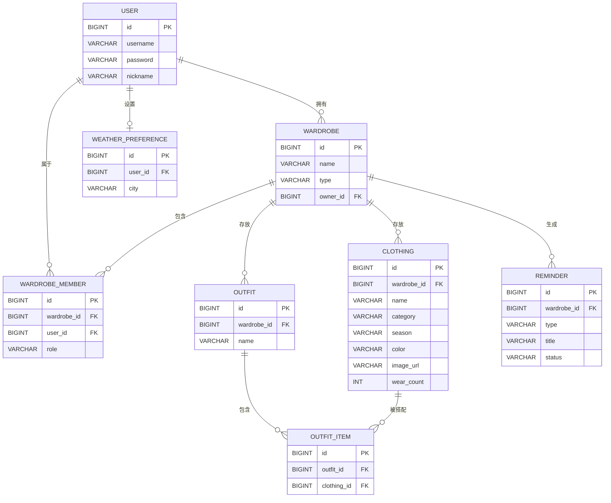

# 电子衣橱系统 · 论文支撑材料

> 论文题目：《基于 Spring Boot 与 Vue3 的电子衣橱系统的设计与实现》
> 本文档汇总数据库 E-R 图、系统架构图、核心接口清单、数据库表说明与论文章节目录，可直接用于论文第 2～4 章。

---

## 一、系统总体架构（前后端分离）

```
浏览器(Vue3 + Element Plus 单页应用)
        │  HTTPS / AJAX(Bearer JWT)
        ▼
前端构建/静态服务(Vite 开发服务器 / Nginx 生产托管)
        │  反向代理 /api → 后端
        ▼
Spring Boot 后端(Controller → Service → Repository/JPA)
        │
        ├──► MySQL 8.0（业务数据持久化）
        ├──► 本地文件存储（衣物图片，可替换为对象存储）
        └──► OpenWeatherMap 天气 API（无 Key 时降级本地模拟）
```

设计要点：
- 前后端完全分离，通过 RESTful API 与 JSON 交互。
- 统一返回结构 `Result<T>`，全局异常统一处理。
- 基于 JWT 的无状态鉴权；拦截器放行 `/api/auth/**`、`/api/files/**`。
- 多角色（OWNER/ADMIN/MEMBER）按「衣柜」维度做数据隔离。

---

## 二、数据库 E-R 图（mermaid）



---

## 三、数据库表清单（8 张）

| 表名 | 说明 | 关键字段 |
|------|------|----------|
| `user` | 用户 | id, username(唯一), password(BCrypt), nickname |
| `wardrobe` | 衣柜 | id, name, type(PERSONAL/SHARED), owner_id |
| `wardrobe_member` | 衣柜成员 | wardrobe_id, user_id, role(OWNER/ADMIN/MEMBER) |
| `clothing` | 衣物 | wardrobe_id, name, category, season, color, image_url, wear_count |
| `outfit` | 搭配 | wardrobe_id, name, description, cover_image |
| `outfit_item` | 搭配明细 | outfit_id, clothing_id（关联表） |
| `weather_preference` | 天气偏好 | user_id, city, city_code |
| `reminder` | 提醒 | wardrobe_id, type(IDLE/WEATHER/OUTFIT/IMBALANCE), title, status |

---

## 四、核心接口清单（RESTful）

| 模块 | 方法 | 路径 | 说明 |
|------|------|------|------|
| 认证 | POST | `/api/auth/register` | 注册 |
| 认证 | POST | `/api/auth/login` | 登录，返回 token |
| 用户 | GET | `/api/auth/info` | 当前用户 |
| 用户 | PUT | `/api/auth/profile` | 修改资料 |
| 衣柜 | GET/POST | `/api/wardrobes` | 列表 / 新建 |
| 衣柜 | PUT/DEL | `/api/wardrobes/{id}` | 修改 / 删除（级联） |
| 衣柜 | POST/DEL | `/api/wardrobes/{id}/members` | 成员管理 |
| 衣物 | GET/POST | `/api/wardrobes/{wid}/clothings` | 分页筛选 / 新增 |
| 衣物 | PUT/DEL | `/api/wardrobes/{wid}/clothings/{id}` | 修改 / 删除 |
| 衣物 | POST | `/api/wardrobes/{wid}/clothings/{id}/wear` | 标记穿着 |
| 搭配 | GET/POST | `/api/wardrobes/{wid}/outfits` | 列表 / 新建 |
| 搭配 | GET | `/api/wardrobes/{wid}/outfits/{id}` | 搭配明细 |
| 搭配 | POST | `/api/wardrobes/{wid}/outfits/{id}/apply` | 应用（联动穿着） |
| 天气 | GET/POST | `/api/weather` | 查询 / 保存偏好 |
| 分析 | GET | `/api/wardrobes/{wid}/analytics` | 统计聚合 |
| 提醒 | GET/POST | `/api/wardrobes/{wid}/reminders` | 列表 / 生成 |
| 文件 | POST | `/api/files/upload` | 图片上传 |

> 除 `/api/auth/**`、`/api/files/**` 外均需 `Authorization: Bearer <token>`。

---

## 五、论文章节目录（建议直接套用）

```
第1章 绪论
  1.1 研究背景与意义
  1.2 国内外研究现状（衣橱管理/穿搭推荐类应用）
  1.3 研究内容与目标
  1.4 论文组织结构

第2章 相关技术与开发环境
  2.1 前后端分离架构
  2.2 Vue3 与 Element Plus
  2.3 Spring Boot 与 JPA
  2.4 MySQL 数据库
  2.5 JWT 鉴权、ECharts 可视化
  2.6 开发环境（JDK8 / Maven / Node / MySQL）

第3章 系统需求分析
  3.1 可行性分析（技术/经济/操作）
  3.2 功能性需求（6 大模块，配功能结构图）
  3.3 非功能性需求（性能/安全/可用性）
  3.4 用例分析

第4章 系统设计
  4.1 总体架构设计（配架构图）
  4.2 数据库设计（E-R 图 + 表结构）
  4.3 功能模块设计
  4.4 接口设计与安全设计
  4.5 关键算法（闲置判定、不均衡判定、穿衣建议）

第5章 系统实现
  5.1 开发环境搭建
  5.2 登录与鉴权模块实现
  5.3 衣物管理模块实现
  5.4 手动搭配模块实现
  5.5 天气联动模块实现
  5.6 数据分析模块实现
  5.7 场景提醒模块实现

第6章 系统测试
  6.1 测试环境与策略
  6.2 功能测试（各模块测试用例）
  6.3 性能测试
  6.4 测试结论

第7章 总结与展望
参考文献
致谢
```

---

## 六、可作为论文创新点的设计
1. **多角色 + 多衣柜隔离**：以「衣柜」为数据边界，支持个人/家庭共享场景。
2. **离线可用的天气联动**：无 API Key 时自动降级本地模拟，保证演示稳定。
3. **场景化智能提醒**：基于穿着频次与闲置天数，自动生成闲置/不均衡/天气/搭配四类提醒。
4. **全栈前后端分离**：Vue3 组合式 API + Spring Boot 2.7（Java 8），工程规范、易部署。
